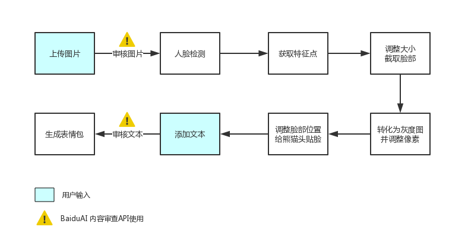

# Product requirements

|         |            |
| ------------- |:-------------:|
| Target release      | 2019-01-16 |
| Epic      |  Crazy Pandaman Meme Generator      |
| Document status | Completed      |
| Designer      | Observer-L |
| Developer      | Observer-L      |
| QA | Observer-L      |

## Goals
* Our goal is to create a automatic meme generator that allows you to add custom text and image to make your own pandaman memes.
* to create infinite possibility with a simple app.
* easy come easy go, share your custom memes with friends and have fun!

## Background and strategic fit
* As the years went on and Facebook was introduced, the popularity of memes started to skyrocket. Soon enough, users of QQ, wechat and other social platforms in China was even creating some "Chinese style" memes about their real-life drama! Fast forward to the present day and you see memes everywhere from Twitter to your wechat moments. Younger generations can’t even remember a time when memes didn’t exist! 
* One of the most famous memes in China is "Pandaman":
  
You'll find that the faces are always the same except for the words and actions.  
The fixed template limits our creativity, we want to be creative, we need a tool to create!   
That's the main reason I want to build this app.

## Assumptions
### How can I customize my meme?
* You can use the generator to add text captions to established memes or upload your own images as templates.
* You can move and resize the text boxes by dragging them around.
* You can customize the font color, outline color, and outline width just to the right of where you type your text.
* You can further customize the font and add additional text boxes in the More Options section.
### Why is there an "created by Crazy Pandaman Webapp" watermark on my memes? 
* The watermark helps other people find where the meme was created, so they can make memes too! 
* However, if you'd really like to, you can remove our watermark from all images you create.

## Requirements
|    #     |    Title     |       User story     |      Importance     |      Notes     |
| ------------- |:-------------:|:-------------:|:-------------:|:-------------:|
| 1      |war of memes on Wechat    | user want to spoof friends with memes | Must Have |  |
| 2      |Interesting things and people     | something funny make you want to customize memes | Must Have |  |

## User interaction and design
#### Flow Chart
  
The architecture of the application is fairly straightforward.   

#### User interaction and design

## Questions
|    Question     |       Outcome     |
| ------------- |:-------------:|
| image and text may include potentially sensitive content      |  That's what Baidu's image & text censoring APIs need to figure out   |

## Not doing
* provides both free(watermark) and paid features to users
* supports all web fonts and Windows/Mac fonts including bold and italic, if they are installed on your device. Note that Android and other mobile operating systems may support fewer fonts.
* We’ve successfully built the very first part in a program that could be used as an API to generate memes automatically.
By hooking up our program to something like Flask, we could display a web page allowing for users to upload their own images, and get back fully complete memes.  
