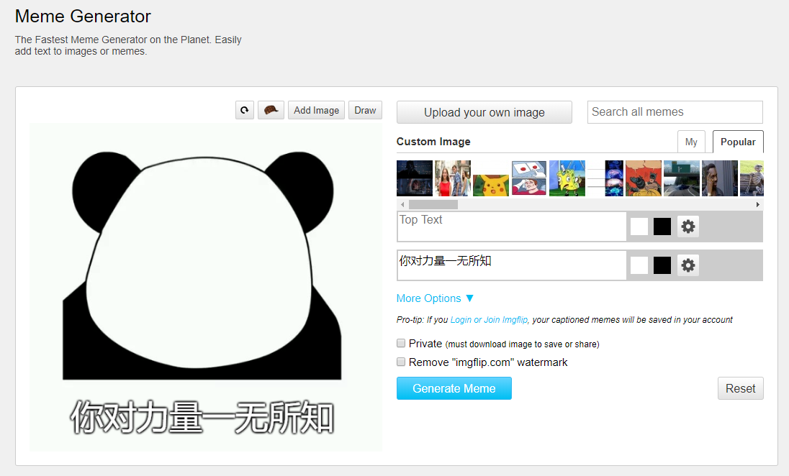

# Product requirements

|         |            |
| ------------- |:-------------:|
| Target release      |  |
| Epic      |  sticker/meme generator      |
| Document status | Not started      |
| Designer      | Observer-L |
| Developer      | Observer-L      |
| QA | Observer-L      |

## Goals
1. The Fastest & powerful Sticker/Meme Generator on the Planet. Easily add text or image to make you own meme.

## Background and strategic fit
1. user generally get memes and stickers from third parties while don't know where and how to custom their own.
2. a meme generator for human is needed, especially in a high frequency chatting app like wechat.

## Assumptions
1. build the app to a WeChat Mini Program with python and baidu api
2. user would probably wanna make a custom sticker when seeing popular stickers or just for fun

## Requirements
|    #     |    Title     |       User story     |      Importance     |      Notes     |
| ------------- |:-------------:|:-------------:|:-------------:|:-------------:|
| 1      |fight with stickers      | user wanna spoof somebody or something interesting | Must Have |  |

## User interaction and design
#### Architecture of Automatic Meme Generator

The architecture of the application is fairly straightforward.   
...

#### interface

## Questions
|    Question     |       Outcome     |
| ------------- |:-------------:|
| image and text may include potentially sensitive content      |  using Baidu's image & text censoring APIs     |

## Not doing
* provides both free(watermark) and paid features to users
* We’ve successfully built the very first part in a program that could be used as an API to generate memes automatically.
By hooking up our program to something like Flask, we could display a web page allowing for users to upload their own images, and get back fully complete memes.  
