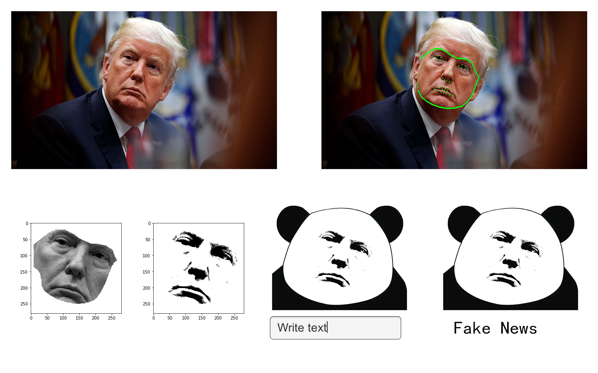
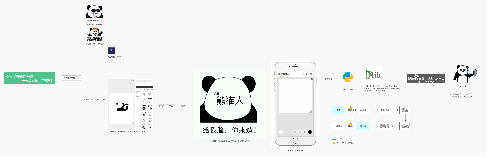
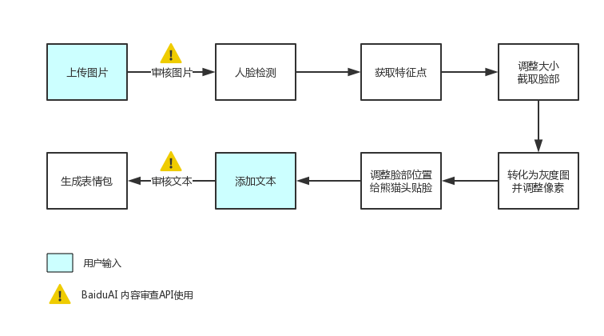

# Meme generator in Python with Face Detection

## what is Crazy Pandaman
Pandaman is one of the most popular memes in China.  
Crazy Pandaman is an app that allows you to make your own pandaman meme.  
[click here for PRD](https://github.com/Observer-L/API_ML_AI/blob/master/PRD.md)  
[click here for demo code](https://github.com/Observer-L/API_ML_AI/blob/master/src/%5BDEMO%5DPandaman%20Meme%20Generator.ipynb)  
[click here to watch the video](http://www.iqiyi.com/w_19s5zz3imd.html)

## What you can do
you can use any static image with face and text as input, the APP will automatically generate a crazy pandaman meme for you!

## Manifest // The Tools of Face Detection and APIs
### Dlib
[Dlib](https://github.com/davisking/dlib) is a modern C++ toolkit containing machine learning algorithms and tools for creating complex software in C++ to solve real world problems.  
In this project, we'll use Dlib’s get_frontal_face_detector, along with the [68 point shape prediction model](https://github.com/davisking/dlib-models).
### APIs
When it comes to sensitive content, we'll use BaiduAI's [Image Censoring API](http://ai.baidu.com/docs#/ImageCensoring-API/top) and [Text Censoring API](http://ai.baidu.com/docs#/TextCensoring-API/top) to handle user's input(both image and text)

## Architecture of Automatic Meme Generator

  

## Where To Go From Here
We’ve successfully built the very [first part](https://github.com/Observer-L/API_ML_AI/blob/master/src/%5BDEMO%5DPandaman%20Meme%20Generator.ipynb) in a program that could be used as an API to generate memes automatically.  
By hooking up our program to something like Flask, we could display a web page allowing for users to upload their own images, and get back fully complete memes.  
